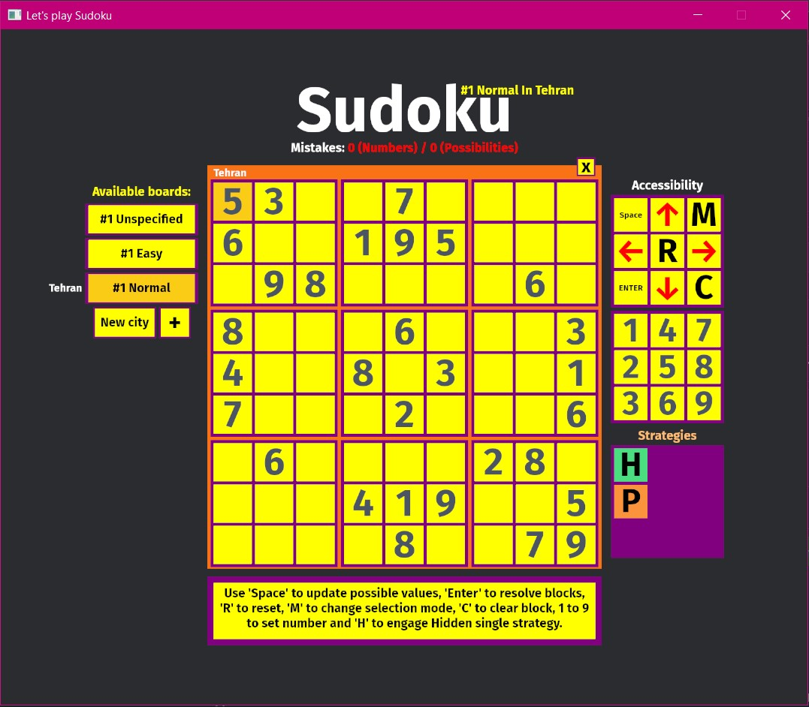

<h1>Sudoku</h1>
<i>A simple sudoku game written in rust using Bevy game engine.</i>

This a sudoku game written using bevy engine on rust; Only for "filling time" purposes.

## Try out

### Web

The game should be available on [repository website](immmdreza.github.io/sudoku/) (which is github page) as a wasm
application. (Just wait for it to load).

### Binaries (Windows/Linux)

Binaries are included for windows and linux in releases. You just need to download
the zip file, unzip and execute the exe file.

### Ha?

If these methods are not working for you, download rust and compile the source code.
